# [Django] 기초 환경 세팅

본격적인 수업을 시작하기 앞서 django의 기초 환경 세팅하는 법을 알려드리겠습니다.


## Django로 프로젝트 시작하기

먼저 바탕화면에 likelion 폴더를 만듭니다. 그후 VS code를 켜고 만든 likelion 폴더를 엽니다.

~~~
cd Desktop
cd likelion
~~~

혹은 likelion 폴더에 오른쪽 버튼을 누른 후 Git Bash Here을 클릭해 터미널 명령어를 활용하여 VS code를 열어도 좋습니다.

```Bash
code .
```

>cd는 하위폴더로 들어가라는 명령어 입니다.
>
>cd .. 은 상위폴더로 올라가라는 명령어 입니다.
>
>ls 는 현재 폴더 내의 목록을 보여달라는 명령어 입니다.

---


## 터미널 Bash로 설정하기

- Vs code를 실행해서 `ctrl`  + ` shift` + `p`를 눌러 설정에 들어갑니다.
<p> 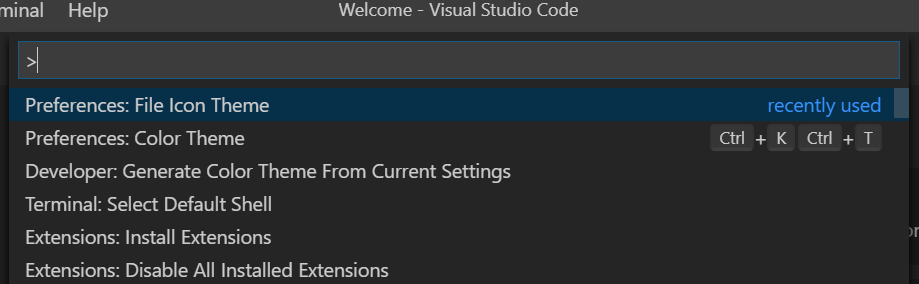</p>

- 검색창에 `Terminal: Select Defualt Shell` 를 검색한 후 클릭합니다.
<p> 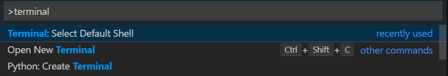</p>

- 그 후 `Git bash` 를 선택합니다.
<p> 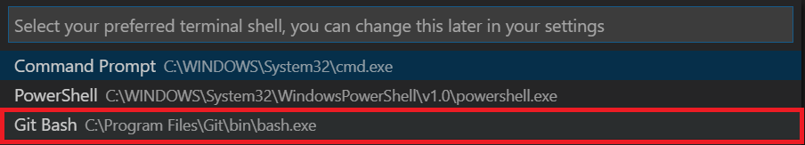</p>
<p> 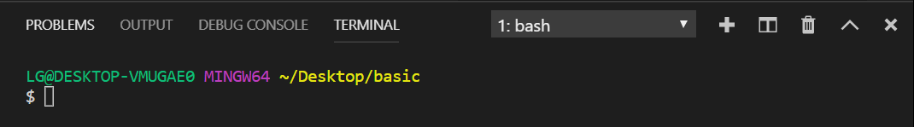</p>

  > linux 환경을 다운받으라면 아무도 안 받을 거니깐 linux와 문법이 같은 bash 터미널을 사용하기 위함입니다!


장고 프로젝트를 시작하려면 가장 먼저 가상환경을 켜야합니다.


---


## 가상환경 켜기

장고 프로젝트를 시작하려면 가장 먼저 가상환경을 생성한 후 켜야합니다.

#### python -m venv 가상환경명


```

=======
python -m venv myvenv
```
위 명령을 치고 나면 옆에 myvenv라는 폴더가 하나 생깁니다.
<p> 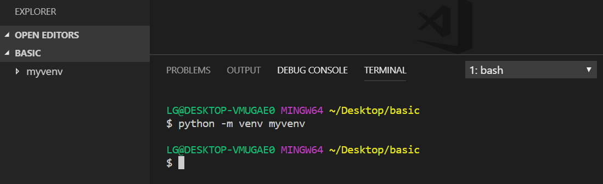</p>


#### 가상환경 실행하기

꼭 터미널 경로에 myvenv 폴더가 있는 위치에서 진행해야 합니다.

~~~
source myvenv/Scripts/activate
~~~
<p> 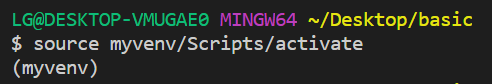</p>
위 명령어를 치면 터미널의 명령어 줄 위에 (myvenv) 라는 것이 생깁니다. 가상환경이 실행되었다는 뜻입니다.

>##### 가상환경을 사용하는 이유
>
>-> 다양한 환경에서 작업하기 위해
>
>-> 다운로드한 파이썬 라이브러리들의 충돌을 방지하기 위해


#### 가상환경 끄기

~~~
deactivate
~~~


---


## Django 설치하기

Django 설치는 반드시 앞에서 한 가상환경을 실행한 상태여야 합니다.

~~~
pip install django
~~~

pip은 파이썬관련 패키지를 설치하기 위해 사용되는 명령어입니다.

> 만일 아래와 같은 사진처럼 뜬다면
><p> 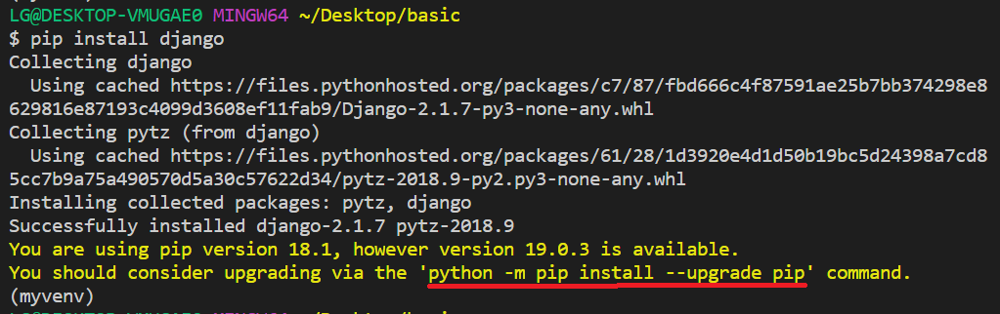</p>

> ~~~
> python -m pip install --upgrade pip
> ~~~
>
> 위 명령어를 쳐서 업그레이드를 진행해 주세요.

>##### 특정 버전 장고 설치하기
>
>~~~
>pip install django==2.1.3
>~~~
>
>`==` 기호를 사용하여 설치하고 싶은 장고버전을 설치할 수 있습니다. 이 부분을 안 쓰면 배포중인 최신버전의 장고가 설치됩니다.


---


## 첫번째 Django 프로젝트 시작하기

가상환경이 켜진 상태에서 바로 아래 명령어를 입력해서 프로젝트를 만듭니다.

#### django-admin startproject 프로젝트 명

~~~
django-admin startproject wordcount
~~~
<p> 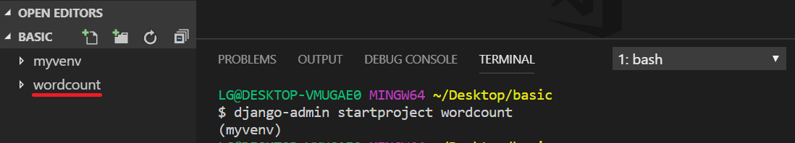</p>

이 후에 wordcount를 하는 페이지를 만들거니 프로젝트 명은 wordcount로 통일해주세요!


wordcount 안에 wordcount라는 폴더가 생겼습니다. 지칭이 헷갈리니 상위 폴더 이름을 wordcountproject로 바꿔줍니다. 그 후 아래 명령어를 입력하여 상위폴더 안으로 터미널 경로를 이동합니다.
<p> 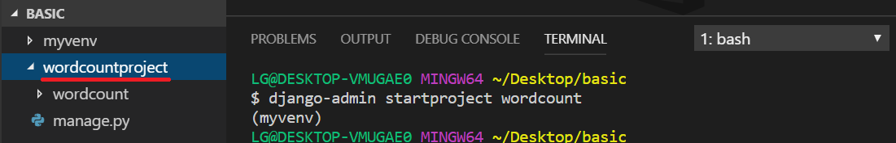</p>
~~~
cd wordcountproject
~~~


---


## Django 서버 작동시키기

이로써 우리의 첫번째 프로젝트 생성이 끝났습니다!!! 와아아~~

아래 명령어를 통해 어떤 웹사이트가 만들어졌는지 확인해봅시다!

~~~
python manage.py runserver
~~~
<p> 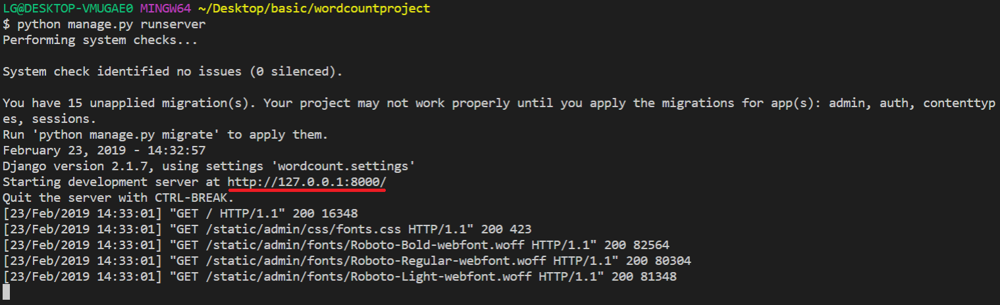</p>
http://127.0.0.1:8000/ 이라는 부분을 `ctrl` + `마우스 왼쪽버튼`을 눌러 브라우저 창을 열어봅시다.

>위 주소는 장고개발을 위해 사용하는 개발서버입니다. 다른 사람들은 접속할 수 없고 개발 하고 있는 사람만 접속할 수 있습니다.

<p> 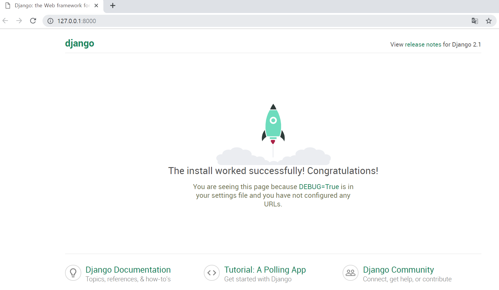</p>

위 화면이 뜨면 성공적으로 장고프로젝트를 생성하고 서버를 작동시킨 겁니다!!! 짝짝짝~~ 이제 첫 발걸음을 잘 딛었네요!

서버를 끄려면 서버가 실행중인 터미널 창에서 `ctrl` + `c`를 누르면 됩니다.
